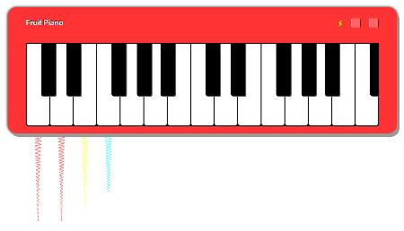
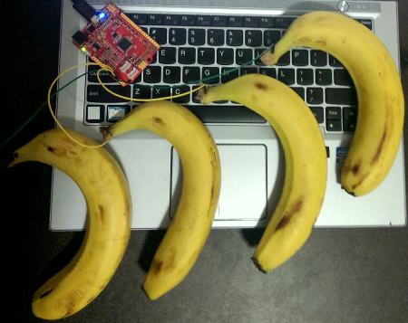

Fruit Piano
===========

A piano is built with a basket of fruit, a microcontroller and a computer.

The idea is from Makey Makey, but uses different hardware and software.
An mbed enabled microcontroller with USB is used. The software running in the
microcontroller is written by C++ using mbed C/C++ SDK.
The site is forked from https://github.com/mrcoles/javascript-piano.

### Get Started

To-do
Go to [Fruit Piano](http://xiongyihui.github.io/piano) to play.
